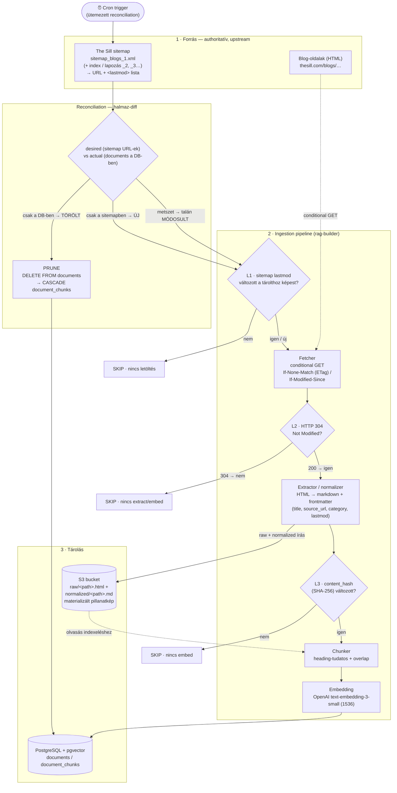

# Tudásbázis-karbantartás — Architektúra-terv

## 1. Cél és hatókör

A tudásbázis ma egy **egyszeri seed**-ből épül (`seed/knowledge/*.md`, 202 cikk). Ez egy pillanatkép:
nincs válasz arra, **honnan frissülnek** a dokumentumok, mi történik egy **új/módosult/törölt** cikkel,
és **mi indítja** az újraindexelést. Ez a terv ezeket a karbantartási folyamatokat tervezi meg.

**Amit megtervez:**

- A dokumentumok **authoritatív forrása** (upstream weboldal, sitemap-alapú felfedezés).
- Egy **materializált objektumtár (S3)**, ami leválasztja a letöltést/normalizálást az indexeléstől.
- A **változásérzékelés** (hogy a változatlan dokumentum ne vektorizálódjon újra).
- Az **új / módosult / törölt** dokumentumok teljes életútja.
- Az **újraindexelés triggere** (ütemezett reconciliation).

## 2. Kiindulás (jelenlegi állapot, SP2) és a hézag

A jelenlegi `rag-builder build` (`apps/rag-builder/src/lib/pipeline.ts`):

1. Kilistázza a `seed/knowledge/*.md` fájlokat.
2. Fájlonként SHA-256 hash-t számol a nyers tartalomra, és a `documents.content_hash`-hez veti
   `source_path` szerint (`getExistingDocumentHashes`). Egyezés → **SKIP** (nincs embed).
3. Eltérés/új → chunkol (heading-tudatos + overlap), embeddel (OpenAI, 1536 dim), majd atomikus
   tranzakcióban `upsertDocumentWithChunks`-ot hív (`documents` upsert `ON CONFLICT (source_path)`,
   majd a doc **összes** chunkja DELETE + újra-INSERT = teljes-dokumentum újraépítés).

**A hézagok, amiket ez a terv betölt:**

| #   | Hézag                               | Következmény                                                                                                                                        |
| --- | ----------------------------------- | --------------------------------------------------------------------------------------------------------------------------------------------------- |
| A   | **Nincs authoritatív forrás**       | a korpusz kézzel bemásolt md-fájlokból áll; nem tudjuk, honnan/mikor frissül                                                                        |
| B   | **Nincs törlés (prune)**            | a builder csak a _létező_ fájlokon iterál; egy eltávolított dokumentum `documents` sora + chunkjai **örökre bennmaradnak** és szennyezik a keresést |
| C   | **Nincs trigger**                   | az indexelés teljesen manuális, nincs ütemezés/reconciliation                                                                                       |
| D   | **Fájlszintű tárolás nem skálázik** | több ezer dokumentumnál a lokális FS nem alkalmas materializált tárnak                                                                              |

## 3. Cél-architektúra — áttekintés

Az alapelv a **reconciliation** („desired vs actual"): minden ütemezett futás összeveti a
**forrás által diktált kívánt állapotot** a **DB tényleges állapotával**, és a különbségből vezeti le
a teendőket. Négy réteg:

1. **Forrás-réteg** — az upstream weboldal (The Sill blog), a `sitemap.xml`-en át felfedezve.
   Ez a **desired state** forrása (mely dokumentumoknak _kellene_ létezniük).
2. **Ingestion pipeline** — sitemap-olvasás → háromszintű változásérzékelés → letöltés → normalizálás →
   chunk → embedding. Ez a `rag-builder` kiterjesztése, ütemezve futtatva.
3. **Tárolás** — kettős: **S3 objektumtár** (nyers HTML + normalizált markdown = materializált pillanatkép)
   és **PostgreSQL + pgvector** (`documents` / `document_chunks` = kereshető index).
4. **Reconciliation & prune** — a sitemap-halmaz és a DB-halmaz diffje; a forrásból eltűnt dokumentumok
   hard delete-je (cascade a chunkokra).

## 4. Adatfolyam-ábra (Mermaid) + stage-enkénti magyarázat

A teljes adatfolyam — forrás, változásérzékelés, chunk, embed, tárolás, és a törlés/módosítás útja.

**Stage-enkénti magyarázat (a végleges ábrához):**

- **⏰ Cron trigger** — a folyamat egyetlen belépője; időzítve indít egy teljes reconciliation-futást.
  Nincs ember a hurokban; a kézi futtatás (`--force`, `--dry-run`) csak operátori kivétel.
- **1 · Forrás (sitemap + HTML)** — a `sitemap_blogs_1.xml` (és a sitemap-index további lapjai) adják a
  **kívánt dokumentum-halmazt** URL + `<lastmod>` párokként. A tényleges cikktartalom a blog-HTML-ekben van,
  amiket csak akkor töltünk le, ha a változásérzékelés megköveteli (szaggatott él a Fetcherhez).
- **Reconciliation (diff)** — a sitemap URL-halmazát (`desired`) összeveti a `documents` DB-halmazzal (`actual`):
  `desired \ actual` = ÚJ, `actual \ desired` = TÖRÖLT, a metszet pedig átfut a változásérzékelésen.
- **L1 · lastmod-kapu** — a legolcsóbb szűrő: ha a sitemap `<lastmod>` egyezik a tárolttal, **le sem töltjük**
  az oldalt. Egyetlen sitemap-kérés az egész korpuszra elég.
- **Fetcher (conditional GET)** — csak a potenciálisan változott/új URL-eket tölti le, `If-None-Match`
  (tárolt ETag) / `If-Modified-Since` fejlécekkel, politeness-szabályokkal (user-agent, rate-limit, `robots.txt`, retry).
- **L2 · 304-kapu** — ha a szerver `304 Not Modified`-ot ad, **nincs extract és nincs embed**.
- **Extractor / normalizer** — a letöltött HTML-t tiszta markdown + frontmatterré alakítja
  (`title`, `source_url`, `category` az URL path-szegmensből, `lastmod`). Kimenete az S3-ba íródik.
- **S3 objektumtár** — a materializált pillanatkép (nyers HTML + normalizált MD). Ez az „igazság" a
  chunkoláshoz (a Chunker innen olvas), és audit/rollback forrás (bucket-verziózással).
- **L3 · content_hash-kapu** — a normalizált markdown SHA-256 hash-e a `documents.content_hash`-hez mérve;
  egyezés → **nincs embed** (kozmetikai HTML-változásokat kiszűri, amelyek a tartalmat nem érintik).
- **Chunk → Embed → pgvector** — csak a ténylegesen megváltozott dokumentumoknál; a mai atomikus
  „teljes-dokumentum újraépítés" (replaceChunks) marad.
- **PRUNE** — a forrásból eltűnt dokumentumok DB-sorának hard delete-je; a chunkokat az `onDelete: Cascade` viszi.

## 5. A négy kötelező kérdés

### 5.1 Honnan tudjuk, hogy egy dokumentum változott — és hogy a változatlan ne vektorizálódjon újra?

**Háromszintű, egyre drágább, egyre pontosabb kapu-lánc.** Minden szint egy szűrő, ami megelőzi a
fölösleges (és drága) újra-embeddelést:

| #      | Szint                | Jel                                                                 | Ha _nincs_ változás           | Költség                                |
| ------ | -------------------- | ------------------------------------------------------------------- | ----------------------------- | -------------------------------------- |
| **L1** | sitemap `<lastmod>`  | a tárolt `source_lastmod`-hoz hasonlítva                            | **le sem töltjük** a lapot    | 1 sitemap-kérés / teljes korpusz       |
| **L2** | HTTP conditional GET | tárolt `ETag`/`Last-Modified` → `If-None-Match`/`If-Modified-Since` | **304** → nincs extract/embed | 1 HEAD/GET / gyanús dokumentum         |
| **L3** | content hash         | normalizált markdown SHA-256 (mai `content_hash`)                   | egyezés → **nincs embed**     | 1 hash-számítás / letöltött dokumentum |

Csak akkor van chunk → embed → tárolás, ha **mind a három kapu** változást jelez. Az embedding
(a legdrágább, hálózati OpenAI-hívás) így csak a valóban új tartalomra fut. Az L3 önmagában is elég a
helyességhez (mint ma); az L1/L2 tisztán **költség- és sávszélesség-optimalizálás**, hogy a legtöbb
dokumentumot le se kelljen tölteni.

### 5.2 Mi történik egy új dokumentummal?

A sitemapben megjelenik egy URL, amihez **nincs** `documents` sor (`desired \ actual`):
**fetch → extract/normalize → S3-ba írás → chunk → embed → insert** a `documents` és `document_chunks`
táblákba. A `source_path`/`source_url` az URL-ből, a `category` az URL path-szegmensből származik.

### 5.3 Mi történik egy törölt dokumentum chunkjaival?

A dokumentum eltűnik a sitemapből, de a DB-ben még ott van (`actual \ desired`):
**hard delete** a `documents` sorra; a `document_chunks` az `onDelete: Cascade` (lásd `schema.prisma`)
miatt automatikusan törlődik → a vektorkeresés azonnal tiszta, nincs árva chunk.
Az S3-objektum kezelése: alapból törlődik a hard-delete szándékkal összhangban, de a **bucket-verziózás**
megőrzi a korábbi verziót auditra/visszaállításra (a DB a kereshető index; az S3 az archívum).

### 5.4 Mikor / mi triggereli az újraindexelést?

**Ütemezett (cron) teljes reconciliation.** A cron periodikusan újratölti a sitemapet, kiszámolja a
diffet, és lefuttatja a fenti pipeline-t (új + módosult + törölt egy menetben). Nincs file-watcher és
nincs esemény-alapú webhook; a cron reconciliation önmagában konvergens (idempotens: a változatlan
dokumentumokat a kapu-lánc kiszűri). A kézi `--force` (teljes újraépítés) és `--dry-run` (előnézet,
letöltés/DB-írás nélkül, a tervezett törléseket is megmutatva) operátori eszközként megmarad.

## 6. Komponensek és felelősségek (terv-szint)

Minden komponens egyetlen felelősséggel, injektálható interfész mögött (tesztelhetőség hálózat/DB nélkül —
a jelenlegi `BuildDeps`/DI-minta folytatása).

| Komponens                            | Felelősség                                                                                                                                    | Függőség            |
| ------------------------------------ | --------------------------------------------------------------------------------------------------------------------------------------------- | ------------------- |
| **`SourceAdapter`** (új interfész)   | `list()` → `{url, lastmod}[]`; `fetch(url, conditional)` → tartalom vagy 304. A The Sill sitemap-implementáció mögötte; más forrás beköthető. | HTTP                |
| **`ChangeDetector`** (új)            | A háromszintű kapu-lánc (L1 lastmod, L2 ETag/304, L3 content-hash) kiértékelése dokumentumonként.                                             | tárolt állapot (DB) |
| **`Extractor`** (új)                 | HTML → normalizált markdown + frontmatter.                                                                                                    | —                   |
| **`ObjectStore`** (új interfész)     | Raw HTML + normalizált MD írás/olvasás S3-ba; verziózás.                                                                                      | S3                  |
| **`Chunker`** (megvan)               | Heading-tudatos chunkolás + overlap.                                                                                                          | —                   |
| **`Embedder`** (megvan)              | OpenAI `text-embedding-3-small`, 1536 dim.                                                                                                    | OpenAI              |
| **`KnowledgeStore`** (megvan, bővül) | `pg` adat-hozzáférés: upsert (RW), search/stats (RO). **Új:** `pruneDocuments(keepSourcePaths)`.                                              | Postgres            |
| **`Reconciler`** (új)                | A halmaz-diff + a pipeline vezénylése (ÚJ/MÓDOSULT/TÖRÖLT ágak).                                                                              | a fentiek           |
| **`Scheduler`** (új, infra)          | A cron-trigger; a `Reconciler` periodikus indítása.                                                                                           | cron                |

## 7. Séma-hatás (terv-szint)

A `documents` tábla a conditional-fetch állapottal bővülne (a `source_url` már megvan):

| Új oszlop                            | Cél                                            |
| ------------------------------------ | ---------------------------------------------- |
| `source_lastmod` (timestamptz, null) | L1 kapu — a sitemap `<lastmod>`-ja             |
| `etag` (text, null)                  | L2 kapu — az upstream ETag `If-None-Match`-hez |
| `http_last_modified` (text, null)    | L2 kapu — `If-Modified-Since`-hez              |
| `last_checked_at` (timestamptz)      | mikor néztük utoljára (obszervabilitás)        |

A `content_hash` marad az L3 kapu (mint ma). A `document_chunks` séma változatlan; a `onDelete: Cascade`
adja a prune-t. Az S3-ETag (objektum-szintű) **külön** az upstream-ETagtől — ne keverjük.
